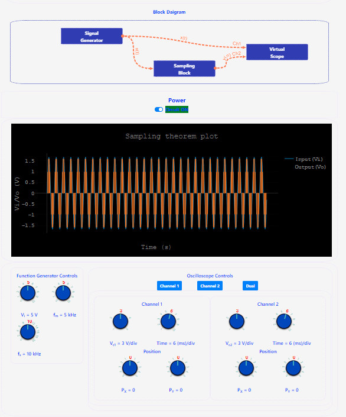

## Procedure

1. Click on the Experiment tab SIMULATOR will open the workspace
                              
2. Read the instruction to understand how the simulation to be executed.

3. Observe the block diagram and power on the circuit

4. Select the amplitide(A) of the input sine wave signal(x(t)).
                            
5. Select the frequency of the signal(fm) for the input signal(x(t)).              
                            
6. Select the sampling frequency of the signal(fs).                   
                            
7. Click on the "Channel 1" buttton to observe the input signal x(t) on graph.                  
                               
8. Click on the "Channel 2" to buttton observe the sampled output signal y(n) on graph.
                              
9. Click on the "Dual" to observe the input signal and output signal on graph.                     
                             
10. Change the values of A, fm, and fs to observe the variation in the input and output signals.                   
                            
11. Hover on the graph to observe the value of the x(t) and y(n) at that instatnt of time T.                   
                               
12. Save the graph if you are done with your experiment.           
                              
13. Note:                       
-Make sure always input signal amplitude(A) >0 v
-Make sure always input signal frequency(fm and fs) >0 Hz
-To change the values just scroll by hovering on the knob.
-Make sure that you kept equal time/div in the "Channel 1" and "Channel 2".
                            
