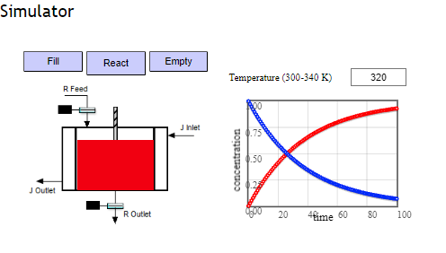

## Procedure

1. Click on the Experiment tab SIMULATON will open the workspace
                              
2. By default tank is full.

3. You can Empty and Fill using the button

4. Click React button to run the simulation.
                            
5. You can change Temparature (300-340K) by input the value and hit enter.              
                            
         
