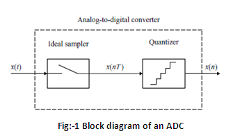
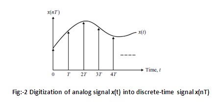
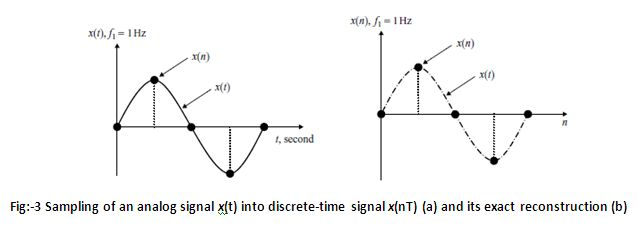
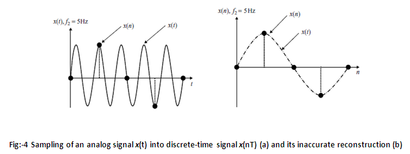

## Introduction

**About the Experiment**

This experiment enables a student to learn

-How to view the real life analog signal with an oscilloscope.
-How to set the amplitude, frequency and phase of the signal source.
-How to set the sampling frequency of the source such that the signal is exactly reconstructed from its samples.
The principal objective of this experiment is to understand the principle of sampling of continuous time analog signal.

## Theory

                        
The real life signals that we encounter in our day to day basis are mostly analog signals. These signals are defined continuously in time and have infinite range of amplitude values. In order to process these signals to obtain meaningful information, they need to be converted to a format which is easily handled by computing resources like microprocessors, computers etc... The first step in this process is to convert the real-time signal into discrete-time signals. Discrete-time signals are defined only at a particular set of time instances. They can thus be represented as sequence of numbers with continuous range of values.

The process of converting an analog signal (denoted as x(t)) to a digital signal (denoted as x(n)) is called the analog-to-digital conversion (referred to as digitization), usually performed by an analog-to-digital converter (ADC). Here t is the continuous time variable and n is the sequence order. In many applications after the processing of the digital signal is performed, x(n) needs to be converted back to analog signal x(t) before it is applied to appropriate analog device. This reverse process is called digital-to-analog conversion and is typically performed using a digital-to-analog converter (DAC).

The typical block diagram of an ADC is shown in Fig. 1 below.  
                            

                             
                             
                            Figure 1 (IC 74138)

 

The process of digitization consists of first sampling (digitization in time) and quantization (digitization in amplitude). In this experiment we will study and understand the principle of sampling, while the principle of quantization will be studied in the next experiment. The sampling process depicts an analog signal as a sequence of values. The basic sampling function can be carried out with an ideal 'sample-and-hold' circuit which maintains the sampled signal until next sample is taken. An ideal sampler can be considered as a switch that periodically opens and closes every T seconds. The sampling frequency (fs in Hertz) is thus defined as

fs=1T....(1)
The sampled discrete time signal x(nT) , n=0,1,2,.... of the original continuous time signal x(t) is shown in Fig. 2 below. 

                             
                             
                            Figure 2 (IC 74138)

                            
In order to represent an analog signal x(t) by a discrete-time signal x(nT) accurately, so that the analog signal can be exactly reconstructed back from the discrete-time signal, the sampling frequency fs must be at least twice the maximum frequency component (fM) of the original analog signal. Thus we have,

fs≥2fm....(2)
The minimum sampling rate is called the Nyquist rate and the above Sampling Theorem is called the Shannon's Sampling Theorem. When an analog signal is sampled at fs , frequency components higher than fs/2 fold back into the frequency range [0, fs/2]. This folded frequency components overlap with the original frequency components in the same range and leads to an undesired effect known as aliasing. In this case, the original analog signal cannot be recovered from the sample data.

Consider an analog signal of frequency 1Hz as shown in Fig. 3(a) below. The sampling frequency is 4Hz. The sampled signal is shown in Fig. 3(b), Note that an exact reconstruction of the missing samples is obtained so long as the Shannon's Sampling Theorem is satisfied.  

                             
                             
                            Figure 3 (IC 74138)

Now let's consider, the analog signal of frequency 5Hz as shown in Fig. 4(a) below. The sampling frequency is same as above, i.e. 4Hz. The sampled signal is shown in Fig. 4(b), Note that the reconstruction of the original analog signal is not possible since the sampling frequency does not satisfy Shannon's Sampling Theorem. In this case the reconstructed signal has a frequency of 1Hz. The signal of 5Hz is folded back as 1Hz, into the range determined by the sampling frequency leading to the problem of aliasing.  

                             
                             
                            Figure 4 (IC 74138)

     

                           

     
 