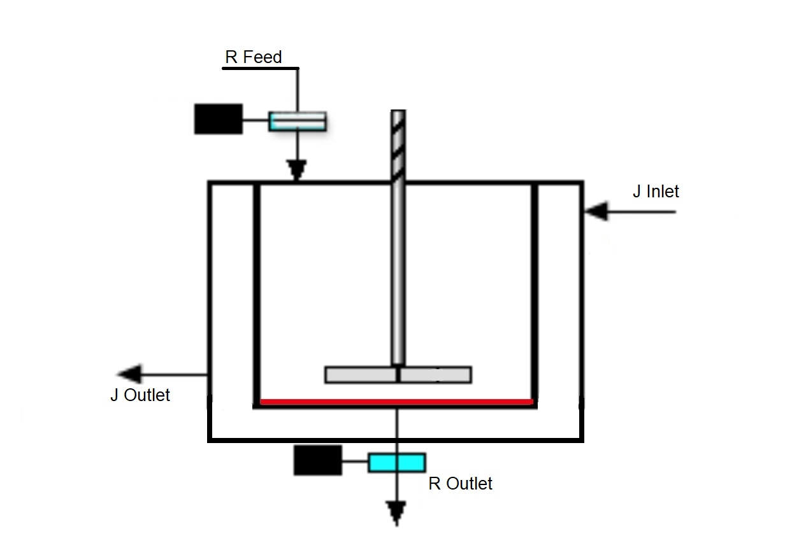

## Theory

### Heat

Heat can be defined as the transfer of energy across the boundary of a system due to a temperature difference between the system and its surroundings. Heat should not be confused with internal energy which is essentially all the energy of a system that is associated with its atoms and molecules - when viewed from a reference frame at rest with respect to the object. It's important to understand the fact that internal energy can undergo a change even when there is no transfer of heat. Consider an adiabatic vessel with a movable lid-pulling the lid, in such a manner that the volume of vessel expands, results in cooling and consequent decrease of internal energy even though there was no transfer of heat from surroundings.

## 1. Modes of Heat Transfer
Transfer of heat can take place through three different mechanisms
### 1.1 Conduction
                           
Conduction can be understood as a process in which energy transfer occurs from a more energetic body to a less energetic process primarily due to collisions between them. Conduction takes only when there is a temperature difference between two parts of the conducting medium. Let's explore the dependence of the conduction rate with change in temperature. Consider a thin plate of thickness Δx and cross sectional area A. Let the temperature of thickness at one face be and at the opposite face be . It has been experimentally found that heat flow will take place between the two faces. If the time interval is ΔT and the heat flow ΔQ, then it has been found that
                            
$$\frac{\Delta Q}{\Delta T}=k\frac{\Delta T}{\Delta x}$$

### 1.2 Convection

 Unlike conduction, convection involves bulk transport of fluids from one place to another which consequently results in exchange of heat from the hotter to colder substance. In brief, the heat energy transferred due to movement of a heated substance is convection. Land and sea breezes are a good example of the phenomenon of convection. During the night, the land cools faster due to poor conductivity of land. This leads to differential heating of the air above land and water. The air above seas is hotter. Since hot air is lighter, it rises up resulting in cool breezes from the land blowing in above seas and the hot air being transported to land resulting in warm night breezes. The reverse process is repeated during the day. This entire phenomenon is based on convection currents and is an example of natural convection. Natural convection is essentially due to the difference in the densities of the fluids which results in their subsequent motion. When fluids are made to move due to some external forces such as a fan or a blower as the case maybe, then it's called forced convection.

<h4 style="text-align:center;">Figure 1.1 Convection Currents</h4>

### 1.3 Radiation
Radiation heat exchange between two bodies at different temperatures always results in a net transfer of heat energy from the body at a higher temperature to the other at a lower temperature.Heat transfer by radiation is important role in many heating and cooling operation and equipment such as operation of a furnace ,thermal cracking, various types of kilns etc.Radiation heat loss from a process equipment becomes significant when its temperature is considerably different from that of the ambient. Therefore process of radiation is necessary for thermal calculation in a varity of physical situation. Thermal radiation is the emission of electromagnetic waves from all matter that has a temperature greater than absolute zero.Thermal radiation incident on a body tends to increase its temperature .Its depending upon the nature of the material constituting the body and its surface characteristics ,the incident radiation may be absorbed,reflected, or transmitted, partly or fully.
 
2. Introduction

Mixing Vessels play an essential role in chemical processes. Its utilities are varied and range from mixing chemicals to changing temperatures of fluids. In the study of stirred tank heaters, we will use it primarily as an instrument for varying the temperature of fluid present in the tank. We generally use a heating coil or jacket filled with a hot fluid surrounding the tank. Here, we will be using the coil to heat the tank. For simplicity, we will have the same phase for both the tank fluid and the coil fluid. We also assume that no change of phase takes place in either of the fluids i.e. the ones in the tank and in the surrounding coil. For studying our setup in detail, it's important to get acquainted with the following terms.

2.1 Material and Energy Balance

 Chemical Processes usually require flow of substances. As the materials pass through various processing operations, it becomes extremely important to accurately understand and subsequently describe their flow. This is done with the help of material and energy balance which are essentially based on the principles of mass and energy conservation. If the unit operation, whatever its nature is seen as a whole it may be represented diagrammatically as a box. The mass and energy going into the box must balance with the mass and energy coming out.
 2.2 Material Balance

The law of conservation of mass leads to what is called a mass or a material balance.
Mass In = Mass Out + Mass Stored Raw Materials = Products + Wastes + Stored Materials.

2.3 Energy Balance

Energy, just like mass, is conserved in the processing operations. The energy coming into a unit operation can be balanced with the energy coming out and the energy stored.
Energy In = Energy Out + Energy Stored

2.4 Steady State

A situation in which all the state variables remain constant despite parallel processes trying to change them, is referred to as the steady state.

2.5 Time Constant

When we talk about time constant, it's essential to take into account the context in which we are talking about it. In our case, time constant can be defined as 63% of the time that will be taken for a body to reach steady state.

2.6 Setup

Let's have a look at the setup we are going to use in our experiment.

2.7 Assumptions

<ul>
 <li>The density of the coil as well as the tank's fluid material remains constant.</li>
<li>The specific heat capacity of the coil as well as the tank's fluid material remains constant.</li>
<li>The stirring is such that as soon as a drop of material enters the tank or the coil it has the same temperature as that of the rest of the bulk material.</li>
<li>The fluid is incompressible.</li>
<li>No accumulation occurs inside the tank or the coil, i.e., mass inflow is equal to the mass outflow.</li>
<li>No radiation takes place</li>
<li>There is only one state of a particular fluid present in the tank as well as the coil throughout the experiment, i.e., the state of the fluid dose not change during the experiment.</li>
</ul>

2.8 Tank Analysis

Now, let's apply the concepts we learnt just now. We will consider the tank first. The fluid is entering it with a temperature and flow rate and leaving it with a temperature and flow rate . We assume that temperature inside the tank is uniform and is equal to the outlet temperature. We will assume this for the coil as well. Now, applying mass conservation 
  
<b>Mass stored = Mass in - Mass out</b>

  
$$\frac {d(S d_t)}{dt}=V_i d_t - V_o d_t$$

where S denotes the volume of the tank. Assuming that the tank volume stays the same and the density of the fluid is a constant, then 

 $$\frac{dS}{dt}=0$$ 

$$V_i = V_o$$

Now, we will apply energy conservation 
<b>Energy In = Energy Stored + Energy Out </b> 
In the case of the stirred tank heater 
Energy in = Energy through inflow + Energy through heat transfer =

$$V_i d c_p(T_i - T_{gr}) + H$$ 

 where,
 
$$T_{gr} \ - \ Reference \ Temperature $$

 <b>H</b> - Rate of Heat Transfer into the tank  
 
 $$C_p \ - \ Specific \ Heat \ Capacity $$
 
$$ Energy \ stored \ = \frac{d(S d_t c_p(T_i - T_{gr})}{dt}$$

$$Energy \ Out = V_o d_t c_p(T_o - T_{gr})$$

  Hence,  
  
$$V_i d c_p(T_i - T_{gr}) + H = d((S d_t c_p(T_i - T_{gr}))$$

$$\frac{S d_t c_p d(T_o - T_{gr})}{dt} = V_o d_t C_p[(T_i - T_{gr})+(T_i - T_{gr})] + H \ as \ (V_i - V_o)$$

$$\frac{S d T_o}{d_t} = V_o(T_i - T_o) + \frac{H}{d_t c_p}$$

2.9 Coil Analysis

 

The fluid is entering the coil with a temperature `T_(i-coil)` and the flow rate `V_(i-coil)` and leaving it with the temperature `T_(i-coil)` and flow rate `V_(i-coil)`. `d_(coil)` is the density of fluid in the coil. We will now consider the coil and will repeat the same things which we did for the tank. 
Applying mass conservation,  
Mass Stored = Mass In - Mass Out
$$\frac{d(S_{coil} d_j)}{dt} = V_{i- coil} d_{coil} - V_{o - coil} d_{coil}$$

where S denotes the volume of the coil. Assuming that the coil volume stays the same and the density of the fluid is a constant, then  

$$\frac{d S_{coil}}{dt} = 0$$
   
$$V_{i-coil} = V_{o - coil}$$

As in the case of the tank 
<b>Energy In= Energy Store + Energy Out</b> 

$$V_{i-coil} d_{coil} c_{p-coil}(T_{i-coil}-T_{gr}) - H = \frac{d(S_{coil} d_{coil} c_{p-coil}(T_{i-coil}-T_{gr}))}{dt} + V_{o-coil}d_{coil} c_{p-coil}(T_{o - coil}-T(gr))$$

$$S_{coil} d_{coil} c_{p-coil} \frac{d (T_{o - coil}-T(gr))}{dt} = V_{o-coil}d_{coil} c_{p-coil}[(T_{i-coil}-T_{gr}) + (T_{o-coil} - T(gr))] + H \ as \ V_{i-coil} = V_{o-coil}$$

$$S_{coil} \frac{d(T_{o-coil})}{dt} = V_{o-coil}(T_{i-coil} - T_{o-coil}) + \frac{H}{d_{coil} c_{p-coil}}$$

 We can Replace the H in the equation with UA(T_(o-coil) - T_o) where U and A are the heat transfer coefficient and the area exposed to heat transfer .
 Finally we have to solve these two ordinary differential equation to get the steady state temperatures of the tank as well as the coil.

     
 
